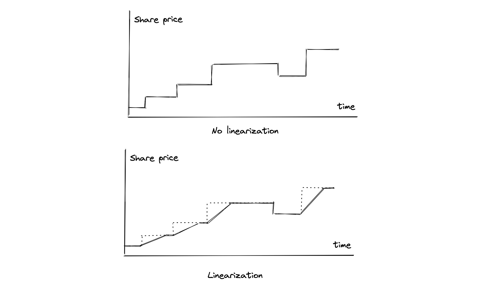

# Yakisoba async ERC4626 vault contracts

Yakisoba vaults are an alernative breed of ERC4626 vaults, which allows instant redemptions of illiquid assets. The smart contracts were developped during my time at Astrolab.fi, which focused on cross-chain yield aggregation. Since the project decided to move on to a different architecture, I'm open-sourcing them here. 

The contracts in their current form have been audited by Hexens. You can find the audit [here](https://hexens.io/audits#astrolab).

Note: The vaults were initially called "Crates", I changed the name to avoid any confusion with Astrolab's current products.

## Set up

- Download dependencies using `npm install`.
- Run tests using `npx hardhat test` or `hh test`

### Liquidity

Cross-chain liquidity brings a lot of complexity regarding the UX and the stability of the interactions. In a naive implementation, you may have tokens in a pool on chain B, your vault with which users interacts is on chain A. A user can withdraw by calling the yakisoba vault, which will send a cross-chain message to chain B, to pull funds and forward them to the user. Several problems arise:

- Cross-chain calls are not cheap, and you need to ask the user to pay for two calls, as you have to fund the bridge to the home chain.
  The user has to wait around 10 minutes. If large funds are involved, this creates stress.
- If the liquidity on chain B has a problem (ex: a lending pool is at 100% utilization), the call fails. Funds can then be pulled from another pool (if available), another chain, etc... this adds complexity and possible failures.
- You have to estimate closely the gas needed for withdrawal. Too much gas means high transaction costs for the user. Too low means a failed transaction that the protocol will have to cover with its own funds.
- Race conditions can arise depending on the implementation.

To solve this, we chose to add a liquidity pool inside of the Yakisoba that acts as a buffer. The pool, called `Swap`, is a fork of Synapse's stableswap, itself a fork of Saddle Finance.

#### **The liquidity buffer**

The logic of the liquidity buffer is the following:

- The pool holds two assets: the underlying asset (e.g USDC), and its virtual equivalent, representing one asset owed by the yakisoba vault.
- When a user wants to exit, he redeems `x` vault tokens, worth `x * share_price` "virtual" assets. Those virtual assets are swapped for the underlying assets.
- A negative slippage can arise, which should be limited as the implementation uses a stableswap. The swap does not bear fees.
- Due to the negative slippage paid on the exit, a user can get a positive slippage on the way in. As the pool empties, the incentives to deposit grow.

This allows the protocol to process redemptions without having to pull liquidity on the fly. Of course, if the pool is depleted, the protocol can rebalance it and internalize the negative slippage.

This is a similar logic to what the LSD does - here the innovation comes from the fact that we don't need to bribe/pay for liquidity. The assets in the pool can be staked on Aave, and forks - we plan to use Sturdy, which provides better yield.

### Bridging

Because we want the protocol to be modular and not tie ourselves to a bridge, bridging is done using adapter contracts - `BridgeConnectorHome` and `BridgeConnectorRemote`. It should manage the messaging and the bridging.

Safety-wise, bridging exposes funds only on the bridge event, which is acceptable (not taking into account the question of bridge tokens).

Messaging is more problematic, as a corrupted message regarding the remote asset quantity could be used to empty the liquidity buffer:

- Send a message saying we have max_uint assets on chain B.
- The share price is now very high
- One vault token allows the hacker to withdraw 100% of the available funds.

To prevent this problem, we require the keeper to "accept" the update on the vault home chain. Thus, a corrupted message won't be exploitable.

### Capital allocation

Capital allocation is done by the keeper. Currently, "owner" is doing everything - a governance contract will do the interface to manage access control and general DAO decisions.

Allocation by chain is done at the vault level. Allocation by strategy is done at the `Allocator` level. For ease of use, the contract is the same for the home chain and the remote chain. If the vault is on the same chain, then the allocator will bypass the bridge connector and directly communicate with the vault.

### Strategies

`Strategy` is the last link before we stake into a yield opportunity. It manages the interface with the farmed protocol - deposit, compound, withdraw. It should be able to adapt to protocols that require to lock and be easy to write to allow broad participation.

### MEV and arbitrage

Even though every cross-chain protocol likes to call itself "omni", information is not instantly shared between chains. As such, arbitrage opportunities arise: let's say the yield generated on a remote chain an increase of 50% of the total assets in the vault. The update of the remote vault would create an easy arbitrage opportunity:

- See the message being sent,
- Deposit,
- Wait for the update to be processed
- Cash out a profit of 50% with minimal risk.

This arbitrage can also be done with classic ERC4626 vaults. The classic mitigations implies:
A) Compound fast enough
B) Add withdraw fees (like Beefy does)
C) Submit transactions through a private relayer such as Flashbots or SecureRPC

`A)` is doable but expensive, `B)` is bad UX-wise, `C)` is not possible.

#### **Linearization of profit**

To solve this, we linearize the profit recorded over a predetermined period (ex: one week):

### Flow

